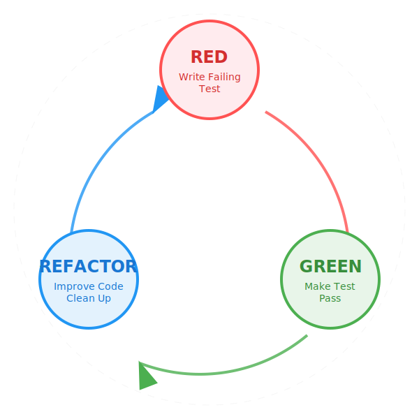

# บทบาทสำคัญของ TDD ในยุค AI

ในขณะที่ AI กำลังเข้ามาปฏิวัติวงการพัฒนาซอฟต์แวร์ เรากำลังเห็นการเปลี่ยนแปลงครั้งสำคัญ **คอขวดของวิศวกรรมซอฟต์แวร์กำลังเปลี่ยนจาก _Implementation_ (การเขียนโค้ด) ไปสู่ _Specification_ (การกำหนดพฤติกรรมของระบบ)**

ในยุคใหม่นี้ **Test-Driven Development (TDD)** ไม่ใช่แค่เทคนิคการประกันคุณภาพ (QA) อีกต่อไป แต่มันคือเครื่องมือหลักในการกำหนด "ข้อกำหนดของซอฟต์แวร์" (Software Specifications) ในภาษาที่ AI ไม่สามารถตีความผิดได้

## 1. แก่นแท้ของ TDD (ทบทวนกันสั้นๆ)
โดยเนื้อแท้แล้ว TDD คือระเบียบวิธีในการออกแบบซอฟต์แวร์ โดยทำตามวัฏจักร **Red-Green-Refactor**:
1.  **Red**: เขียน Test ที่ล้มเหลว (Failing Test) เพื่อกำหนดความต้องการที่เฉพาะเจาะจง
2.  **Green**: เขียนโค้ดเพียงพอให้ Test ผ่าน
3.  **Refactor**: ปรับปรุงโครงสร้างโค้ดให้ดีขึ้นโดยไม่เปลี่ยนพฤติกรรมของมัน

วัฏจักรนี้ช่วยให้มั่นใจว่าโค้ดสามารถทดสอบได้ (Testable), เป็นสัดส่วน (Modular), และตรงตามความต้องการ

## 2. การเปลี่ยนแปลง: จาก Implementation สู่ Specification

ในอดีต Devs ใช้เวลา 80% ไปกับ **Implementation**—ต้องต่อสู้กับ Syntax, Library, และโค้ด Boilerplate ต่างๆ
ด้วยเครื่องมือ AI (เช่น Copilot, Cursor, Gemini), **Implementation กำลังกลายเป็นเรื่องง่าย (Commodity)** AI สามารถสร้างโค้ดที่ทำงานได้จริงภายในไม่กี่วินาที

อย่างไรก็ตาม AI ไม่สามารถเข้าใจ *เจตนา (Intent)* ได้อย่างน่าเชื่อถือ
*   **Prompting คือ Specification ที่อ่อนแอ**: ภาษาอังกฤษมีความกำกวม คำสั่งเช่น "ทำให้เร็วขึ้น" หรือ "จัดการ error ด้วย" สามารถตีความได้หลายสิบแบบ
*   **Tests คือ Specification ที่แข็งแกร่ง**: Test case มีค่าเป็น Binary คือไม่ผ่าน ก็ล้มเหลว มันเป็นวิธีเดียวที่ชัดเจนที่สุดในการบอก AI ว่าข้อจำกัดและเงื่อนไขต่างๆ คืออะไร

**ถ้าคุณไม่เขียน Test คุณกำลังพึ่งพาให้ AI เดา Specification เอาเอง**
*   **Hallucination**: AI สามารถเขียนโค้ดที่ผิด หรือมีบั๊กแฝงได้อย่างมั่นใจ
*   **Context Drifting**: AI อาจหลุดโฟกัสจากสถาปัตยกรรมรวมของระบบ
*   **Over-Engineering**: AI อาจเดาความต้องการในอนาคตผิดๆ และเพิ่มความซับซ้อนโดยไม่จำเป็น

## 3. ทำไม TDD ถึงสำคัญยิ่งกว่าเดิม

### A. การต่อสู้กับ Hallucination
หลักฐานชี้ชัดว่าโมเดล AI นั้นเชื่อถือไม่ได้ 100% บ่อยครั้งที่พวกมันสร้าง **Hallucinations**—คือการเขียนโค้ดที่ดูน่าเชื่อถือแต่ใช้งานจริงไม่ได้

ที่อันตรายกว่านั้นคือ เมื่อคุณสั่งให้ AI เพิ่มฟีเจอร์หรือแก้บั๊ก มันมักจะเผลอไปแก้ไขโค้ดส่วนอื่นที่ไม่เกี่ยวข้อง ทำให้ **ฟีเจอร์เดิมที่เคยทำงานได้ดีพังลง (Breaking Pre-existing Features)**
*   **ข้อได้เปรียบของ TDD (The TDD Advantage)**: TDD ช่วยล็อกพฤติกรรมปัจจุบันของระบบไว้ มันทำหน้าที่เป็นระบบแจ้งเตือนทันที หาก AI Hallucination จนทำให้เกิด Regression ชุด Test ของคุณจะจับได้ทันที **TDD คือวิธีเดียวที่ขยายผลได้ (Scalable) ในการปล่อยให้เครื่องจักรที่มีความน่าจะเป็น (Probabilistic Machine) มาแก้ไข Codebase ที่ต้องการความแน่นอน (Deterministic Codebase) ของคุณอย่างปลอดภัย**

### B. Tests คือ Prompt ที่แม่นยำที่สุด
โมเดล AI ทำงานได้ดีที่สุดเมื่อได้รับคำสั่งที่ชัดเจนและไม่กำกวม
*   **ข้อได้เปรียบของ TDD**: Test case ที่เขียนมาดีคือ Prompt ที่ไม่มีความกำกวม การแปะ Failing Test ลงไปในแชทของ AI มักเป็นวิธีที่มีประสิทธิภาพที่สุดในการได้โค้ดที่ถูกต้อง มันช่วยจำกัดขอบเขตการค้นหาของ AI ให้เหลือแค่สิ่งที่จำเป็นเพื่อให้ Test ผ่านเท่านั้น

### C. การ Iteration และ Refactoring อย่างปลอดภัย
AI เก่งมากเรื่องการ Refactoring—การเปลี่ยนโครงสร้างโค้ดโดยไม่เปลี่ยนพฤติกรรม
*   **ข้อได้เปรียบของ TDD**: คุณไม่สามารถใช้ AI เพื่อ Refactor โค้ดเก่า (Legacy Code) หรือปรับจูน Performance ได้อย่างปลอดภัยหากปราศจากชุด Test ที่แข็งแกร่ง TDD มอบตาข่ายนิรภัยให้คุณสามารถปล่อยให้ AI ทดลองปรับแต่งโค้ดได้อย่างเต็มที่ เพราะคุณจะรู้ทันทีหากมีการทำงานผิดพลาด

### D. ป้องกัน "Code Rot"
ด้วยการที่ AI สร้างโค้ดได้เร็วกว่าที่มนุษย์จะรีวิวทีละบรรทัดไหว Codebase สามารถขยายตัวได้อย่างรวดเร็ว
*   **ข้อได้เปรียบของ TDD**: TDD บังคับให้จังหวะการ **ออกแบบ (Design)** (ผ่านการเขียน Test) ช้าลงและมีความรอบคอบ ในขณะที่ปล่อยให้การ **สร้าง (Implementation)** รวดเร็วได้ สิ่งนี้ช่วยให้ Codebase ที่เติบโตอย่างรวดเร็วยังคงดูแลรักษาได้ง่าย (Maintainable) และไม่ผูกติดกันจนแก้ยาก (Decoupled)

## 4. วัฏจักร TDD ที่เสริมพลังด้วย AI (The AI-Enhanced TDD Cycle)
Workflow จะปรับเปลี่ยนเล็กน้อยเพื่อใช้ประโยชน์จาก AI:

1.  **มนุษย์**: เขียน **Test** (The Spec) *ขั้นตอนนี้ต้องใช้การคิดวิเคราะห์และความรู้ในโดเมน*
2.  **AI**: สร้าง **Implementation** เพื่อให้ Test ผ่าน
3.  **มนุษย์ & AI**: ร่วมมือกัน **Refactor** มนุษย์เป็นคนกำหนดทิศทางสถาปัตยกรรม ในขณะที่ AI จัดการเรื่องการแก้ Syntax

## บทสรุป
ในโลกที่ขับเคลื่อนด้วย AI คุณค่าหลักของ Devs กำลังเปลี่ยนจาก "ผู้เขียน Syntax" ไปเป็น "ผู้กำหนด Requirements" TDD คือเครื่องมือที่ใช้กำหนดความถูกต้องนั้นอย่างเป็นทางการ การเชี่ยวชาญใน TDD จะช่วยให้คุณเปลี่ยน AI จากเครื่องสร้างโค้ดที่ยุ่งเหยิง ให้กลายเป็น Junior Developer ที่มีความเร็วสูง มีวินัย และทำงานอย่างไม่รู้จักเหน็ดเหนื่อยเพื่อให้ตรงตาม Specification ที่คุณวางไว้อย่างเคร่งครัด
